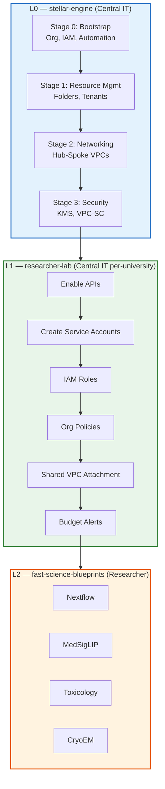
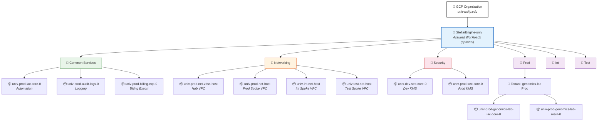
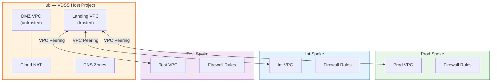
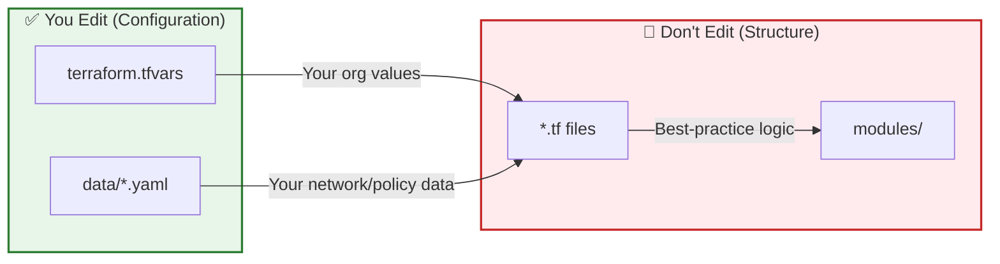

# Fast Science — GCP Landing Zone Foundation (L0)

An implementation of [Stellar Engine](https://github.com/gcp-stellar-engine/stellar-engine) for research institutions. This repo deploys a production-ready GCP Organization landing zone using Terraform — the folders, projects, IAM, networking, and security controls that must exist before researchers can run workloads. Built on Stellar Engine's IaC with compliance overlays (FedRAMP High, IL4, IL5) available when needed.

---

## Architecture Overview

Stellar Engine is **Layer 0** (L0) of a three-tier "Fast Science" architecture:



| Layer | Repo | Owner | Purpose |
|-------|------|-------|---------|
| **L0** | `stellar-engine` (this repo) | Central IT | GCP org landing zone — folders, projects, networking, security |
| **L1** | `researcher-lab` | Central IT per-university | Provision individual researcher projects within the landing zone |
| **L2** | `fast-science-blueprints` | Researchers | Science workloads — Nextflow, MedSigLIP, Toxicology, etc. |

---

## What L0 Creates

Running all 4 stages produces this GCP resource hierarchy:



**Stage 0** creates the top-level folder + Common Services (3 projects). **Stage 1** creates Networking/Security/Environment folders + per-tenant projects. **Stage 2** creates network host projects + VPCs. **Stage 3** creates KMS projects + keys.

---

## Prerequisites

This guide assumes you have already completed the [GCP Enterprise Setup Checklist](https://cloud.google.com/docs/enterprise/setup-checklist) — specifically, you have a verified domain, a Google Cloud Organization, and either Google Workspace or Cloud Identity configured.

### 1. Install Tools

Install the following on your workstation:

- **[Google Cloud SDK](https://cloud.google.com/sdk/docs/install)** (`gcloud` CLI)
- **[Terraform](https://developer.hashicorp.com/terraform/install)** ≥ 1.7
- **[jq](https://jqlang.github.io/jq/download/)** (used by helper scripts)

Authenticate and set your account:

```bash
gcloud auth login
gcloud auth application-default login
```

### 2. GCP Organization

You need a GCP Organization with a verified domain. Run in your terminal:

```bash
gcloud organizations list
```

Example output:
```
DISPLAY_NAME       ID            DIRECTORY_CUSTOMER_ID
university.edu     1234567890    C000001
```

- **Organization ID** → the `ID` column
- **Customer ID** → the `DIRECTORY_CUSTOMER_ID` column (used for Domain Restricted Sharing org policy — optional)

### 3. Billing Account

Run in your terminal:

```bash
gcloud beta billing accounts list
```

Note the `ACCOUNT_ID` value (format: `012345-67890A-BCDEF0`).

### 4. Choose Your Prefix

Pick a prefix of **≤7 characters** using **only alphanumeric characters** (no hyphens or underscores). E.g.: `univ`. The prefix flows through every resource name automatically — see [naming convention](documentation/naming-convention.md).

### 5. Bootstrap Project

Create a "seed" project. This is the first GCP project in your org — Stellar Engine uses it to bootstrap automation:

```bash
export PREFIX="univ"                        # Your chosen prefix
export ORG_ID="1234567890"                  # Your org ID
export BILLING_ID="012345-67890A-BCDEF0"    # Your billing account ID

# Create the bootstrap project
gcloud projects create ${PREFIX}-bootstrap --organization=${ORG_ID}
gcloud billing projects link ${PREFIX}-bootstrap --billing-account=${BILLING_ID}
gcloud config set project ${PREFIX}-bootstrap

# Set the quota project for Application Default Credentials
# (required for org policy APIs when running Terraform locally)
gcloud auth application-default set-quota-project ${PREFIX}-bootstrap
```

### 6. Enable Required APIs

Run from the repo root:

```bash
cd fast/stages-aw/0-bootstrap
chmod +x enableServices.sh
./enableServices.sh
```

This enables: IAM, Cloud KMS, Pub/Sub, Service Usage, Resource Manager, BigQuery, Assured Workloads, Cloud Billing, Logging, IAM Credentials, Org Policy.

### 7. Google Groups

Stellar Engine uses groups (from the [GCP Enterprise Setup Checklist](https://cloud.google.com/docs/enterprise/setup-checklist)) for all org-level IAM bindings. Create these 5 groups using whichever method matches your identity setup:

| Group | Purpose |
|-------|---------|
| `gcp-billing-admins@yourdomain` | Billing administration |
| `gcp-devops@yourdomain` | DevOps / automation |
| `gcp-vpc-network-admins@yourdomain` | Network administration |
| `gcp-organization-admins@yourdomain` | Organization administration |
| `gcp-security-admins@yourdomain` | Security administration |

<details>
<summary><b>Option A: Google Workspace Admin Console</b></summary>

If your org uses Google Workspace, create groups in [Admin Console → Groups](https://admin.google.com/ac/groups).

</details>

<details>
<summary><b>Option B: gcloud CLI (Cloud Identity / Workforce Identity Federation)</b></summary>

If your org uses Cloud Identity or Workforce Identity Federation, create groups programmatically. This requires the Cloud Identity API enabled on your bootstrap project (created in step 5):

```bash
# Enable Cloud Identity API on your bootstrap project
gcloud services enable cloudidentity.googleapis.com

export DOMAIN="yourdomain.com"
export ORG_ID="1234567890"

for GROUP in gcp-billing-admins gcp-devops gcp-vpc-network-admins gcp-organization-admins gcp-security-admins; do
  gcloud identity groups create "${GROUP}@${DOMAIN}" \
    --organization="${ORG_ID}" \
    --display-name="${GROUP}" \
    --description="Stellar Engine ${GROUP} group"
done
```

These Cloud Identity groups work with Workforce Identity Federation — your external IdP maps federated identities into these GCP groups, which then receive IAM bindings from Stellar Engine.

</details>

### 8. Grant Bootstrap IAM Roles

```bash
cd fast/stages-aw/0-bootstrap
chmod +x setIAM.sh
./setIAM.sh your-email@yourdomain.com ${ORG_ID}
```

This grants the 13 org-level roles needed to run Stage 0 (logging admin, org admin, project creator, billing admin, etc.).

---

## Stage 0: Bootstrap

**Directory:** `fast/stages-aw/0-bootstrap/`  
**What it creates:** Top-level folder, Common Services folder, automation project, audit logs project, billing export project, service accounts, GCS state buckets, org policies, custom roles.

### Step 1 — Configure variables

```bash
cd fast/stages-aw/0-bootstrap
cp terraform.tfvars.sample terraform.tfvars
```

Edit `terraform.tfvars` — lines marked `# ← CHANGE` are the values you must set to match your environment. Everything else can stay as-is:

```hcl
# ─── MUST CHANGE: Your org-specific values ─────────────────────
prefix            = "univ"                        # ← CHANGE: ≤7 chars
bootstrap_project = "univ-bootstrap"              # ← CHANGE: the project you created in step 5
alert_email       = "cloud-ops@university.edu"    # ← CHANGE: who receives alerts

organization = {
  domain      = "university.edu"                  # ← CHANGE: from gcloud organizations list
  id          = 1234567890                        # ← CHANGE: from gcloud organizations list
  customer_id = "C000001"                         # ← CHANGE: from gcloud organizations list (optional)
}

billing_account = {
  id = "012345-67890A-BCDEF0"                     # ← CHANGE: from gcloud beta billing accounts list
}

regions = {
  primary = "us-east4"                            # ← CHANGE: your preferred region
}

# ─── OPTIONAL: Change only if needed ───────────────────────────
# Set regime to "COMPLIANCE_REGIME_UNSPECIFIED" to skip Assured Workloads
# Set to "FEDRAMP_HIGH", "IL5", "IL4", etc. to enable compliance overlay
assured_workloads = {
  regime   = "COMPLIANCE_REGIME_UNSPECIFIED"
  location = "us-east4"
}

# If you used the default group names in step 7, leave these as-is
groups = {
  gcp-billing-admins      = "gcp-billing-admins"
  gcp-devops              = "gcp-devops"
  gcp-vpc-network-admins  = "gcp-vpc-network-admins"
  gcp-organization-admins = "gcp-organization-admins"
  gcp-security-admins     = "gcp-security-admins"
}

# ─── DEFAULTS: Leave as-is unless you know what you're doing ──
org_policies_config = {
  import_defaults = false
  constraints = {
    allowed_policy_member_domains = []
  }
}

fast_features = {
  envs = true
}

log_sinks = {
  audit-logs = {
    filter = "logName:\"/logs/cloudaudit.googleapis.com%2Factivity\" OR logName:\"/logs/cloudaudit.googleapis.com%2Fsystem_event\" OR protoPayload.metadata.@type=\"type.googleapis.com/google.cloud.audit.TransparencyLog\""
    type   = "pubsub"
  }
  vpc-sc = {
    filter = "protoPayload.metadata.@type=\"type.googleapis.com/google.cloud.audit.VpcServiceControlAuditMetadata\""
    type   = "pubsub"
  }
  workspace-audit-logs = {
    filter = "logName:\"/logs/cloudaudit.googleapis.com%2Fdata_access\" and protoPayload.serviceName:\"login.googleapis.com\""
    type   = "pubsub"
  }
  empty-audit-logs = {
    filter = ""
    type   = "pubsub"
  }
}

outputs_location = "~/fast-config"
```

### Step 2 — First apply (with bootstrap user)

On the very first run, temporarily add `bootstrap_user` to relax org policies:

```bash
# Add this line to terraform.tfvars temporarily:
# bootstrap_user = "your-email@university.edu"

terraform init
terraform plan
terraform apply
```

### Step 3 — Second apply (enforce org policies)

Remove `bootstrap_user` from `terraform.tfvars`, then re-apply:

```bash
# Remove the bootstrap_user line from terraform.tfvars
terraform plan
terraform apply
```

### Step 4 — Verify outputs

```bash
terraform output project_ids
terraform output service_accounts
terraform output assured_workload
```

Stage 0 outputs are automatically written to `~/fast-config/` (or GCS bucket) for Stage 1 to consume.

---

## Stage 1: Resource Management

**Directory:** `fast/stages-aw/1-resman/`  
**What it creates:** The organizational folder structure — Networking, Security, and Environment folders. Also creates automation service accounts and state buckets for Stages 2-3. This stage does **not** create department or researcher projects — those are handled by L1 (researcher-lab).

### Step 1 — Link outputs from Stage 0

```bash
cd fast/stages-aw/1-resman
../../stage-links.sh ~/fast-config
# Copy and paste the output commands
```

### Step 2 — Configure variables

```bash
cp terraform.tfvars.sample terraform.tfvars
```

Edit `terraform.tfvars`:

```hcl
# ─── Environment Folders ──────────────────────────────────────
# Start with Prod only. Add Int/Test later as needed.
envs_folders = {
  Prod = { admin = "gcp-organization-admins@university.edu" }
}

# ─── Features ─────────────────────────────────────────────────
fast_features = {
  envs = true
}

# No tenant projects — department/researcher projects are created by L1 (researcher-lab)
```

### Step 3 — Apply

```bash
terraform init
terraform plan
terraform apply
```

---

## Stage 2: Networking

**Directory:** Choose one:
- `fast/stages-aw/2-networking-a-fedramp-high/` — FedRAMP High compliant
- `fast/stages-aw/2-networking-b-il5-ngfw/` — IL5 with Palo Alto NGFW

**What it creates:** Hub VPC (VDSS) host project, per-environment spoke VPC host projects, VPC peering, firewall rules, Cloud NAT, DNS zones.



### Step 1 — Link outputs from previous stages

```bash
cd fast/stages-aw/2-networking-a-fedramp-high  # or 2-networking-b-il5-ngfw
../../stage-links.sh ~/fast-config
# Copy and paste the output commands
```

### Step 2 — Customize network data files

Edit the YAML factory files in `data/`:

| File | What You Set |
|------|-------------|
| `data/cidrs.yaml` | IP address ranges |
| `data/subnets/<env>/*.yaml` | Subnet definitions per environment |
| `data/firewall-rules/<env>/rules.yaml` | Firewall rules per VPC |
| `data/dns-policy-rules.yaml` | DNS response policy rules |

### Step 3 — Apply

```bash
terraform init
terraform plan
terraform apply
```

---

## Stage 3: Security

**Directory:** `fast/stages-aw/3-security/`  
**What it creates:** Dev and Prod KMS projects, HSM-backed keyrings and keys across US regions, VPC Service Controls perimeter (optional).

### Step 1 — Link outputs and set default project

```bash
cd fast/stages-aw/3-security
../../stage-links.sh ~/fast-config
# Copy and paste the output commands

# Set default project to the automation project
gcloud config set project $(cd ../0-bootstrap && terraform output -raw project_ids | jq -r .automation)
```

### Step 2 — Apply

```bash
terraform init
terraform plan
terraform apply
```

### Step 3 — Lock down service accounts (production hardening)

```bash
chmod +x sa_lockdown.sh
./sa_lockdown.sh
```

### Step 4 — Optionally delete the bootstrap project

```bash
chmod +x delete_gcp_project.sh
./delete_gcp_project.sh --project-id=${PREFIX}-bootstrap
```

---

## What You Touch vs What You Don't



| Stage | ✅ Edit | 🚫 Don't Edit |
|-------|---------|---------------|
| **0-bootstrap** | `terraform.tfvars` — prefix, org, billing, groups, regime, features | `*.tf` — automation, org, IAM, logging logic |
| **0-bootstrap** | `data/org-policies/*.yaml` — org policy rules | `variables.tf` — type definitions |
| **0-bootstrap** | `data/custom-roles/*.yaml` — custom IAM roles | |
| **1-resman** | `terraform.tfvars` — tenants, envs_folders, features | `branch-*.tf` — folder/SA creation logic |
| **2-networking** | `data/cidrs.yaml`, `data/subnets/*.yaml`, `data/firewall-rules/*.yaml` | `net-vdss.tf`, `main.tf` — network topology |
| **3-security** | `terraform.tfvars` — kms_keys, vpc_sc | `core-dev.tf`, `core-prod.tf` — KMS project logic |
| **3-security** | `data/vpc-sc/*.yaml` — VPC-SC perimeter definitions | |

> **Why?** Keeping `.tf` files untouched means your fork stays merge-able with upstream [Cloud Foundation Fabric](https://github.com/GoogleCloudPlatform/cloud-foundation-fabric). Your customizations live entirely in config/data files that upstream doesn't ship with real values.

### How Naming Works

Your prefix automatically propagates to every resource:

```
terraform.tfvars: prefix = "univ"
    ↓
main.tf: local.prefix = join("-", ["univ", "prod"])  →  "univ-prod"
    ↓
automation.tf: module { name = "iac-core-0", prefix = "univ-prod" }
    ↓
GCP: project "univ-prod-iac-core-0" ✅
```

See [naming convention documentation](documentation/naming-convention.md) for the full spec: `{base}-{regime}-{env}-{role}-{0-9}`.

---

## Next Steps: L1 and L2

Once all 4 stages complete successfully, your landing zone is ready.

```
✅ L0 Complete — Your GCP organization has:
   • Folder hierarchy with compliance boundary
   • Automation project with Terraform service accounts
   • Hub-and-spoke networking with firewall rules
   • KMS encryption keys (HSM-backed)
   • Org policies and audit logging

→ Next: Provision researcher projects via L1 (researcher-lab)
→ Then: Researchers run science workloads via L2 (fast-science-blueprints)
```

---

## Modules

The suite of [modules](./modules/) is designed for rapid composition and reuse. All modules share a similar interface: IAM support, resource creation/modification, multiple resource creation where sensible, and no side-effects. Modules ending with `-se` are Stellar Engine-specific modifications. See each module's README for usage.

## Blueprints

Compliance-mapped blueprints for [FedRAMP High](./blueprints/fedramp-high/) and [IL5](./blueprints/il5/) — from full end-to-end services (CNAP) to individual GCP services. See each blueprint's README.

---

<details>
<summary><b>📚 Reference Documentation</b></summary>

### Detailed Deployment Guide (DDG)

Step-by-step deployment manual covering all stages, IAM prerequisites, and troubleshooting. [View DDG](https://docs.google.com/document/d/1UOaHefcxHCl2C4CbYsTl37ZRxB4xmDHbWmfLcF0VY70/edit?pli=1&tab=t.0#heading=h.7axmtvj2exmb) (requires access).

### Technical Design Document (TDD)

Architecture framework covering IAM, org hierarchy, hub-and-spoke networking, encryption, and compliance. [View TDD](https://docs.google.com/document/d/15WMwslyCrkmuI7EutGBd7YXH3K8P3KrwzLOGcv-W4t8/edit?resourcekey=0-mjoA_PGM2MkIMPpr75SQbQ&tab=t.0) (requires access).

### Security Best Practices Guide (SBPG)

Security hardening framework with Mandiant pen-test recommendations. [View SBPG](https://docs.google.com/document/d/1uv62Fqg73r9oJNP-NPZebpzoBom8rOgLoHkiMZPutbo/edit?usp=sharing) (requires access).

### Cybersecurity Documentation

NIST 800-53r5 control mappings for FRH, IL4, IL5. [View docs](https://drive.google.com/drive/folders/1NeWZcOuxysi7kUNRCFDd8CeHnxF14ywp) • [Path to Authorization guide](https://docs.google.com/document/d/1vyrWgLIXWkZO3c5qkqLhltmo4LMrVfDHx0EQCuQMYac/edit?tab=t.0#heading=h.qyoze3epkux8) (requires access).

### Assured Workloads

Google Cloud Assured Workloads simplifies creating compliant environments (FedRAMP, HIPAA, CJIS, etc.). [Pricing and docs](https://cloud.google.com/security/products/assured-workloads?hl=en).

</details>

<details>
<summary><b>🤝 Contributing</b></summary>

- **View access:** Fill out this [form](https://docs.google.com/forms/d/e/1FAIpQLScetWXBErWaopYrGa8qKz6vFZOz1-_O0o_HAU4tr4vdhMzWpQ/viewform) for [GitHub](https://github.com/gcp-stellar-engine/stellar-engine) access
- **Issues:** Create an issue on GitHub and email [stellar-engine@google.com](mailto:stellar-engine@google.com)
- **Code contributions:** Email [stellar-engine@google.com](mailto:stellar-engine@google.com) for developer access

</details>

<details>
<summary><b>⚖️ License & Disclaimers</b></summary>

This is not an officially supported Google product. This project is not eligible for the [Google Open Source Software Vulnerability Rewards Program](https://bughunters.google.com/open-source-security).

</details>
