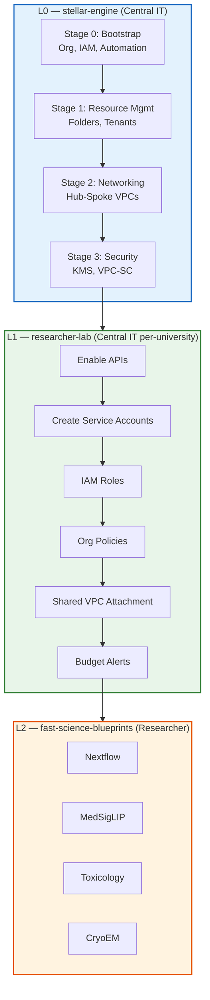
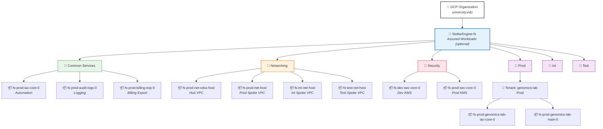
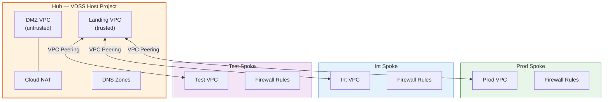
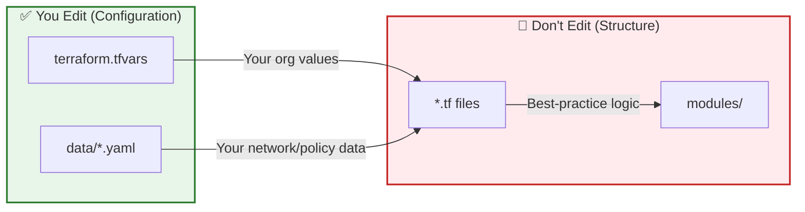

# Stellar Engine — GCP Landing Zone Foundation (L0)

Stellar Engine deploys a production-ready GCP Organization landing zone using Terraform. It creates the folders, projects, IAM, networking, and security controls that must exist before any workloads can run. Assured Workloads compliance overlays (FedRAMP High, IL4, IL5) are optional.

---

## Architecture Overview

Stellar Engine is **Layer 0** (L0) of a three-tier "Fast Science" architecture:



| Layer | Repo | Owner | Purpose |
|-------|------|-------|---------|
| **L0** | `stellar-engine` (this repo) | Central IT | GCP org landing zone — folders, projects, networking, security |
| **L1** | `researcher-lab` | Central IT per-university | Provision individual researcher projects within the landing zone |
| **L2** | `fast-science-blueprints` | Researchers | Science workloads — Nextflow, MedSigLIP, Toxicology, etc. |

---

## What L0 Creates

Running all 4 stages produces this GCP resource hierarchy:



**Stage 0** creates the top-level folder + Common Services (3 projects). **Stage 1** creates Networking/Security/Environment folders + per-tenant projects. **Stage 2** creates network host projects + VPCs. **Stage 3** creates KMS projects + keys.

---

## Prerequisites

Before running any Terraform, complete these one-time setup steps.

### 1. GCP Organization

You need a GCP Organization with a verified domain.

```bash
# Get your Organization ID and domain
gcloud organizations list
```

Get your **Customer ID** from [Admin Console](https://admin.google.com) → Account → Account settings.

### 2. Billing Account

```bash
# Get your Billing Account ID
gcloud beta billing accounts list
```

### 3. Google Workspace Groups

Create these groups in [Google Workspace Admin](https://admin.google.com) or Cloud Identity:

| Group | Purpose |
|-------|---------|
| `gcp-billing-admins@yourdomain` | Billing administration |
| `gcp-devops@yourdomain` | DevOps / automation |
| `gcp-vpc-network-admins@yourdomain` | Network administration |
| `gcp-organization-admins@yourdomain` | Organization administration |
| `gcp-security-admins@yourdomain` | Security administration |

### 4. Choose Your Prefix

Pick a **globally unique prefix** of **≤7 characters** (e.g., `fs`, `univ`, `acme`). This flows through every resource name automatically — see [naming convention](documentation/naming-convention.md).

### 5. Bootstrap Project

Create a temporary "seed" project manually:

```bash
export PREFIX="fs"                          # Your chosen prefix
export ORG_ID="1234567890"                  # Your org ID
export BILLING_ID="012345-67890A-BCDEF0"    # Your billing account ID

# Create the bootstrap project
gcloud projects create ${PREFIX}-bootstrap --organization=${ORG_ID}
gcloud billing projects link ${PREFIX}-bootstrap --billing-account=${BILLING_ID}
gcloud config set project ${PREFIX}-bootstrap
```

### 6. Enable Required APIs

```bash
cd fast/stages-aw/0-bootstrap
chmod +x enableServices.sh
./enableServices.sh
```

This enables: IAM, Cloud KMS, Pub/Sub, Service Usage, Resource Manager, BigQuery, Assured Workloads, Cloud Billing, Logging, IAM Credentials, Org Policy.

### 7. Grant Bootstrap IAM Roles

```bash
chmod +x setIAM.sh
./setIAM.sh your-email@yourdomain.com ${ORG_ID}
```

This grants the 13 org-level roles needed to run Stage 0 (logging admin, org admin, project creator, billing admin, etc.).

---

## Stage 0: Bootstrap

**Directory:** `fast/stages-aw/0-bootstrap/`  
**What it creates:** Top-level folder, Common Services folder, automation project, audit logs project, billing export project, service accounts, GCS state buckets, org policies, custom roles.

### Step 1 — Configure variables

```bash
cd fast/stages-aw/0-bootstrap
cp terraform.tfvars.sample terraform.tfvars
```

Edit `terraform.tfvars` with your values:

```hcl
# ─── Core Identity ─────────────────────────────────────────────
prefix            = "fs"                          # ≤7 chars, globally unique
bootstrap_project = "fs-bootstrap"                # The project you created above
alert_email       = "cloud-ops@university.edu"

# ─── Organization ──────────────────────────────────────────────
organization = {
  domain      = "university.edu"
  id          = 1234567890                        # from: gcloud organizations list
  customer_id = "C000001"                         # from: Admin Console
}

# ─── Billing ───────────────────────────────────────────────────
billing_account = {
  id = "012345-67890A-BCDEF0"                     # from: gcloud beta billing accounts list
}

# ─── Region ────────────────────────────────────────────────────
regions = {
  primary = "us-east4"                            # All bootstrap resources go here
}

# ─── Assured Workloads (OPTIONAL) ──────────────────────────────
# Set regime to "COMPLIANCE_REGIME_UNSPECIFIED" to skip Assured Workloads
# Set to "FEDRAMP_HIGH", "IL5", "IL4", etc. to enable compliance overlay
assured_workloads = {
  regime   = "COMPLIANCE_REGIME_UNSPECIFIED"
  location = "us-east4"
}

# ─── Groups ────────────────────────────────────────────────────
# Map to your actual Google Workspace group names (without @domain)
groups = {
  gcp-billing-admins      = "gcp-billing-admins"
  gcp-devops              = "gcp-devops"
  gcp-vpc-network-admins  = "gcp-vpc-network-admins"
  gcp-organization-admins = "gcp-organization-admins"
  gcp-security-admins     = "gcp-security-admins"
}

# ─── Org Policies ──────────────────────────────────────────────
org_policies_config = {
  import_defaults = false
  constraints = {
    allowed_policy_member_domains = []
  }
}

# ─── Features (minimal L0) ────────────────────────────────────
fast_features = {
  envs = true                                     # Environment folders for tenants
}

# ─── Log Sinks ─────────────────────────────────────────────────
log_sinks = {
  audit-logs = {
    filter = "logName:\"/logs/cloudaudit.googleapis.com%2Factivity\" OR logName:\"/logs/cloudaudit.googleapis.com%2Fsystem_event\" OR protoPayload.metadata.@type=\"type.googleapis.com/google.cloud.audit.TransparencyLog\""
    type   = "pubsub"
  }
  vpc-sc = {
    filter = "protoPayload.metadata.@type=\"type.googleapis.com/google.cloud.audit.VpcServiceControlAuditMetadata\""
    type   = "pubsub"
  }
  workspace-audit-logs = {
    filter = "logName:\"/logs/cloudaudit.googleapis.com%2Fdata_access\" and protoPayload.serviceName:\"login.googleapis.com\""
    type   = "pubsub"
  }
  empty-audit-logs = {
    filter = ""
    type   = "pubsub"
  }
}

# ─── Outputs ───────────────────────────────────────────────────
outputs_location = "~/fast-config"
```

### Step 2 — First apply (with bootstrap user)

On the very first run, temporarily add `bootstrap_user` to relax org policies:

```bash
# Add this line to terraform.tfvars temporarily:
# bootstrap_user = "your-email@university.edu"

terraform init
terraform plan
terraform apply
```

### Step 3 — Second apply (enforce org policies)

Remove `bootstrap_user` from `terraform.tfvars`, then re-apply:

```bash
# Remove the bootstrap_user line from terraform.tfvars
terraform plan
terraform apply
```

### Step 4 — Verify outputs

```bash
terraform output project_ids
terraform output service_accounts
terraform output assured_workload
```

Stage 0 outputs are automatically written to `~/fast-config/` (or GCS bucket) for Stage 1 to consume.

---

## Stage 1: Resource Management

**Directory:** `fast/stages-aw/1-resman/`  
**What it creates:** Networking folder, Security folder, Environment folders (Prod/Int/Test), per-tenant folders and projects, automation service accounts per branch.

### Step 1 — Link outputs from Stage 0

```bash
cd fast/stages-aw/1-resman
../../stage-links.sh ~/fast-config
# Copy and paste the output commands
```

### Step 2 — Configure variables

```bash
cp terraform.tfvars.sample terraform.tfvars
```

Edit `terraform.tfvars`:

```hcl
# ─── Tenants ───────────────────────────────────────────────────
# Each tenant gets a folder + IaC project + main project per environment
tenants = {
  genomics-lab = {
    admin_principal  = "group:gcp-devops@university.edu"
    descriptive_name = "Genomics Research Lab"
    locations = {
      gcs = "us-east4"
      kms = "us-east4"
    }
  }
}

# ─── Environment Folders ──────────────────────────────────────
envs_folders = {
  Prod = { admin = "gcp-organization-admins@university.edu" }
  Int  = { admin = "gcp-organization-admins@university.edu" }
  Test = { admin = "gcp-organization-admins@university.edu" }
}

# ─── Features ─────────────────────────────────────────────────
fast_features = {
  envs = true
}
```

### Step 3 — Apply

```bash
terraform init
terraform plan
terraform apply
```

---

## Stage 2: Networking

**Directory:** Choose one:
- `fast/stages-aw/2-networking-a-fedramp-high/` — FedRAMP High compliant
- `fast/stages-aw/2-networking-b-il5-ngfw/` — IL5 with Palo Alto NGFW

**What it creates:** Hub VPC (VDSS) host project, per-environment spoke VPC host projects, VPC peering, firewall rules, Cloud NAT, DNS zones.



### Step 1 — Link outputs from previous stages

```bash
cd fast/stages-aw/2-networking-a-fedramp-high  # or 2-networking-b-il5-ngfw
../../stage-links.sh ~/fast-config
# Copy and paste the output commands
```

### Step 2 — Customize network data files

Edit the YAML factory files in `data/`:

| File | What You Set |
|------|-------------|
| `data/cidrs.yaml` | IP address ranges |
| `data/subnets/<env>/*.yaml` | Subnet definitions per environment |
| `data/firewall-rules/<env>/rules.yaml` | Firewall rules per VPC |
| `data/dns-policy-rules.yaml` | DNS response policy rules |

### Step 3 — Apply

```bash
terraform init
terraform plan
terraform apply
```

---

## Stage 3: Security

**Directory:** `fast/stages-aw/3-security/`  
**What it creates:** Dev and Prod KMS projects, HSM-backed keyrings and keys across US regions, VPC Service Controls perimeter (optional).

### Step 1 — Link outputs and set default project

```bash
cd fast/stages-aw/3-security
../../stage-links.sh ~/fast-config
# Copy and paste the output commands

# Set default project to the automation project
gcloud config set project $(cd ../0-bootstrap && terraform output -raw project_ids | jq -r .automation)
```

### Step 2 — Apply

```bash
terraform init
terraform plan
terraform apply
```

### Step 3 — Lock down service accounts (production hardening)

```bash
chmod +x sa_lockdown.sh
./sa_lockdown.sh
```

### Step 4 — Optionally delete the bootstrap project

```bash
chmod +x delete_gcp_project.sh
./delete_gcp_project.sh --project-id=${PREFIX}-bootstrap
```

---

## What You Touch vs What You Don't



| Stage | ✅ Edit | 🚫 Don't Edit |
|-------|---------|---------------|
| **0-bootstrap** | `terraform.tfvars` — prefix, org, billing, groups, regime, features | `*.tf` — automation, org, IAM, logging logic |
| **0-bootstrap** | `data/org-policies/*.yaml` — org policy rules | `variables.tf` — type definitions |
| **0-bootstrap** | `data/custom-roles/*.yaml` — custom IAM roles | |
| **1-resman** | `terraform.tfvars` — tenants, envs_folders, features | `branch-*.tf` — folder/SA creation logic |
| **2-networking** | `data/cidrs.yaml`, `data/subnets/*.yaml`, `data/firewall-rules/*.yaml` | `net-vdss.tf`, `main.tf` — network topology |
| **3-security** | `terraform.tfvars` — kms_keys, vpc_sc | `core-dev.tf`, `core-prod.tf` — KMS project logic |
| **3-security** | `data/vpc-sc/*.yaml` — VPC-SC perimeter definitions | |

> **Why?** Keeping `.tf` files untouched means your fork stays merge-able with upstream [Cloud Foundation Fabric](https://github.com/GoogleCloudPlatform/cloud-foundation-fabric). Your customizations live entirely in config/data files that upstream doesn't ship with real values.

### How Naming Works

Your prefix automatically propagates to every resource:

```
terraform.tfvars: prefix = "fs"
    ↓
main.tf: local.prefix = join("-", ["fs", "prod"])  →  "fs-prod"
    ↓
automation.tf: module { name = "iac-core-0", prefix = "fs-prod" }
    ↓
GCP: project "fs-prod-iac-core-0" ✅
```

See [naming convention documentation](documentation/naming-convention.md) for the full spec: `{base}-{regime}-{env}-{role}-{0-9}`.

---

## Next Steps: L1 and L2

Once all 4 stages complete successfully, your landing zone is ready.

```
✅ L0 Complete — Your GCP organization has:
   • Folder hierarchy with compliance boundary
   • Automation project with Terraform service accounts
   • Hub-and-spoke networking with firewall rules
   • KMS encryption keys (HSM-backed)
   • Org policies and audit logging

→ Next: Provision researcher projects via L1 (researcher-lab)
→ Then: Researchers run science workloads via L2 (fast-science-blueprints)
```

---

## Modules

The suite of [modules](./modules/) is designed for rapid composition and reuse. All modules share a similar interface: IAM support, resource creation/modification, multiple resource creation where sensible, and no side-effects. Modules ending with `-se` are Stellar Engine-specific modifications. See each module's README for usage.

## Blueprints

Compliance-mapped blueprints for [FedRAMP High](./blueprints/fedramp-high/) and [IL5](./blueprints/il5/) — from full end-to-end services (CNAP) to individual GCP services. See each blueprint's README.

---

<details>
<summary><b>📚 Reference Documentation</b></summary>

### Detailed Deployment Guide (DDG)

Step-by-step deployment manual covering all stages, IAM prerequisites, and troubleshooting. [View DDG](https://docs.google.com/document/d/1UOaHefcxHCl2C4CbYsTl37ZRxB4xmDHbWmfLcF0VY70/edit?pli=1&tab=t.0#heading=h.7axmtvj2exmb) (requires access).

### Technical Design Document (TDD)

Architecture framework covering IAM, org hierarchy, hub-and-spoke networking, encryption, and compliance. [View TDD](https://docs.google.com/document/d/15WMwslyCrkmuI7EutGBd7YXH3K8P3KrwzLOGcv-W4t8/edit?resourcekey=0-mjoA_PGM2MkIMPpr75SQbQ&tab=t.0) (requires access).

### Security Best Practices Guide (SBPG)

Security hardening framework with Mandiant pen-test recommendations. [View SBPG](https://docs.google.com/document/d/1uv62Fqg73r9oJNP-NPZebpzoBom8rOgLoHkiMZPutbo/edit?usp=sharing) (requires access).

### Cybersecurity Documentation

NIST 800-53r5 control mappings for FRH, IL4, IL5. [View docs](https://drive.google.com/drive/folders/1NeWZcOuxysi7kUNRCFDd8CeHnxF14ywp) • [Path to Authorization guide](https://docs.google.com/document/d/1vyrWgLIXWkZO3c5qkqLhltmo4LMrVfDHx0EQCuQMYac/edit?tab=t.0#heading=h.qyoze3epkux8) (requires access).

### Assured Workloads

Google Cloud Assured Workloads simplifies creating compliant environments (FedRAMP, HIPAA, CJIS, etc.). [Pricing and docs](https://cloud.google.com/security/products/assured-workloads?hl=en).

</details>

<details>
<summary><b>🤝 Contributing</b></summary>

- **View access:** Fill out this [form](https://docs.google.com/forms/d/e/1FAIpQLScetWXBErWaopYrGa8qKz6vFZOz1-_O0o_HAU4tr4vdhMzWpQ/viewform) for [GitHub](https://github.com/gcp-stellar-engine/stellar-engine) access
- **Issues:** Create an issue on GitHub and email [stellar-engine@google.com](mailto:stellar-engine@google.com)
- **Code contributions:** Email [stellar-engine@google.com](mailto:stellar-engine@google.com) for developer access

</details>

<details>
<summary><b>⚖️ License & Disclaimers</b></summary>

This is not an officially supported Google product. This project is not eligible for the [Google Open Source Software Vulnerability Rewards Program](https://bughunters.google.com/open-source-security).

</details>
