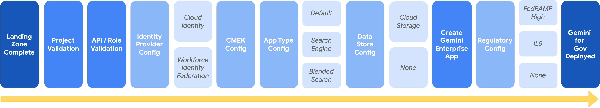

# gem4gov

`gem4gov` is a command-line tool designed to streamline the onboarding process for government customers to Gemi. This tool automates the setup and configuration of the necessary Google Cloud components, ensuring a smooth and efficient deployment.

## Overview

The tool guides the user through a series of steps to configure their Google Cloud project for Agentspace. It handles authentication, role and API validation, identity provider setup, and the creation of Discovery Engine data stores and search engines.

## Prerequisites

Before using this tool, you must have the following:

- Python 3.6+
- The `gcloud` command-line tool installed and authenticated.
- A Google Cloud project with billing enabled.
- A user account with the following IAM roles:
    Org-Level:
    
    - `roles/cloudkms.admin`
    - `roles/discoveryengine.admin`
    - `roles/ml.admin`
    - `roles/resourcemanager.projectIamAdmin`
    - `roles/serviceusage.serviceUsageAdmin`
    - `roles/storage.admin`
    - `roles/bigquery.dataViewer`

## Installation

Follow these steps to install the `gem4gov` command-line tool and make it accessible from your system's PATH.

### 1. Install the Package

From the root of the project directory, install the package in editable mode using `pip3`. This ensures that any changes you make to the source code are immediately available in the installed command.

```bash
pip3 install -e .
```

### 2. Add the Python Binary Directory to Your PATH

To run the `gem4gov` command from any directory, you need to add the directory containing the `gem4gov` executable to your shell's `PATH` environment variable.

First, find the installation location of your Python packages. You can do this by finding the path to the `pip3` (or `pip`) executable, as the `gem4gov` script will be in the same directory.

```bash
which pip3
```

This command will output a path, for example, `/Users/your-user/Library/Python/3.9/bin/pip3`. The directory you need to add to your PATH is the part before `/pip3`, which in this example is `/Users/your-user/Library/Python/3.9/bin`.

Once you have the correct directory path, add it to your shell's configuration file.

**For Zsh users (`.zshrc`):**

```bash
echo 'export PATH="<your_python_bin_directory>:$PATH"' >> ~/.zshrc
source ~/.zshrc
```

**For Bash users (`.bash_profile` or `.bashrc`):**

```bash
echo 'export PATH="<your_python_bin_directory>:$PATH"' >> ~/.bash_profile
source ~/.bash_profile
```
*Note: Replace `<your_python_bin_directory>` with the actual path you found. Depending on your system, you may need to use `.bashrc` instead of `.bash_profile`.*

### 3. Verify the Installation

After installation, you can verify that the `gem4gov` command is available on your PATH by running:

```bash
gem4gov --help
```
This should display the help message for the tool, confirming that it is correctly installed and configured.

## Gemini for Government Onboarding Process



The `onboard` command initiates an interactive process that sets up your Google Cloud project for Gemini for Government. Here is a detailed breakdown of the steps the tool performs:

1.  **Regulatory Boundary Selection**: The user is first asked to select the regulatory data boundary for the deployment: FedRAMP High, IL4, or None. This choice determines which compliance configurations are applied later in the process.

2.  **Project Configuration**: The user is prompted to confirm that a Google Cloud Project has been created within an Assured Workloads folder (if a boundary was selected). The user then provides the Project ID, and the tool configures `gcloud` to use this project.

3.  **IAM Role Validation**: It verifies that the authenticated user has the necessary IAM roles on the specified project. If roles are missing, it lists them and asks the user if they wish to proceed.

4.  **API Validation**: The script checks if the required APIs are enabled in the project. If any are missing, it prompts the user for permission to enable them. The required APIs include:
    - Vertex AI API
    - Discovery Engine API
    - Cloud Resource Manager API
    - Cloud Key Management Service (KMS) API
    - Identity and Access Management (IAM) API
    - Service Usage API
    - Cloud Storage API
    - BigQuery API

5.  **Identity Provider Configuration**: If not already configured, the user is asked to choose an identity provider:
    - **Google Identity**: For users within a Google Workspace.
    - **Third-party Identity Provider**: Via Workforce Identity Federation. The user must provide the Workforce Pool ID.

6.  **CMEK Configuration**: If not already configured, the user is prompted to provide a Cloud KMS key to enable Customer-Managed Encryption Keys (CMEK). The tool validates that the key exists, is in the 'us' multi-region, and is a symmetric key. After validation, it grants the necessary KMS permissions to the Discovery Engine and Cloud Storage service accounts.

7.  **Application Type Selection**: The user selects the type of Gemini Enterprise application to create, which determines its data grounding capabilities:
    - **Default**: Allows interaction with the Gemini assistant and grounding on web search or uploaded documents. No enterprise data stores are connected.
    - **Search Engine**: Provides the default experience plus grounding on a single enterprise data store (Cloud Storage or BigQuery).
    - **Blended Search**: Provides the default experience plus grounding on two or more enterprise data stores.

8.  **Data Store Creation/Validation**: This step is performed only if the user selects the "Search Engine" or "Blended Search" application type.
    - The user can provide a list of existing data store IDs, which the tool will validate.
    - Alternatively, the user can create new data stores interactively:
        - **Google Cloud Storage (GCS)**: The user provides the GCS bucket name and an optional path prefix for the documents.
        - **BigQuery**: The user provides the BigQuery dataset and table, and maps the table schema to predefined keywords for semantic understanding.

9.  **Engine Creation**: The user provides a display name and company name for the Gemini Enterprise application. The tool then creates a new engine, linking the data stores created or validated in the previous step (if applicable).

10. **Regulatory Boundary Configuration**: Based on the boundary selected in the first step, the tool configures the engine and its default assistant to be compliant. This involves disabling features not yet authorized for that boundary. For both FedRAMP High and IL4, this includes:
    - [Agent Gallery](https://docs.cloud.google.com/gemini/enterprise/docs/agents-gallery)
    - [Agent Designer (Private Preview)](https://docs.cloud.google.com/gemini/enterprise/docs/agent-designer)
    - [Analytics](https://docs.cloud.google.com/gemini/enterprise/docs/view-analytics)
    - [Grounding with OneDrive / Google Drive File Uploads](https://docs.cloud.google.com/gemini/enterprise/docs/assistant-chat#upload_and_chat_about_files)
    - [Grounding with Google Search](https://cloud.google.com/vertex-ai/generative-ai/docs/grounding/grounding-with-google-search)
    - [Image Generation](https://docs.cloud.google.com/gemini/enterprise/docs/assistant-analyze#generate_an_image) / [Video Generation](https://docs.cloud.google.com/gemini/enterprise/docs/assistant-analyze#generate_a_video)
    - [Implicit Model Data Caching](https://cloud.google.com/vertex-ai/generative-ai/docs/context-cache/context-cache-overview)
    - [Knowledge Graph / People Connectors](https://docs.cloud.google.com/gemini/enterprise/docs/use-knowledge-graph-search)
    - Location Context
    - [Memory and Customization](https://cloud.google.com/gemini/enterprise/docs/configure-personalization)
    - [Model Armor](https://cloud.google.com/gemini/enterprise/docs/enable-model-armor)
    - [NotebookLM Enterprise](https://docs.cloud.google.com/gemini/enterprise/notebooklm-enterprise/docs/overview)
    - [Prompt Chips / Prompt Gallery](https://cloud.google.com/gemini/enterprise/docs/configure-prompt-chips)
    - [Session Sharing](https://docs.cloud.google.com/gemini/enterprise/docs/share-conversations)
    - [User Event Collection](https://cloud.google.com/gemini/enterprise/docs/user-events)
    - [User Feedback](https://docs.cloud.google.com/gemini/enterprise/docs/configure-feedback)
    - Talk to Content

11. **Manual Configuration**: The user is provided with a direct link to the Google Cloud Console and instructed to manually disable the "Enable user event collection (preview)" feature and then save the configuration.

12. **Completion**: Once all steps are completed, the tool outputs the Project ID, Data Store ID(s), Engine ID, Widget Config ID, and direct URLs to the Data Store(s) and the Gemini Enterprise UI for the user's reference.

## Usage

To start the onboarding process, run the following command from your shell:

```bash
gem4gov onboard
```

The tool will then guide you through the interactive prompts to collect the necessary information for the setup.

## Future Enhancements

- **IL5 Boundary Configuration**: Update the tool to include the specific features that are not supported in the IL5 boundary once they are finalized.
- **Automated Role Granting**: Implement a feature to grant the required IAM roles to the user if they are missing.
- **Configuration File**: Allow users to provide a configuration file to automate the onboarding process without interactive prompts.
- **Error Handling and Retries**: Improve error handling with more specific messages and implement retry logic for API calls.
