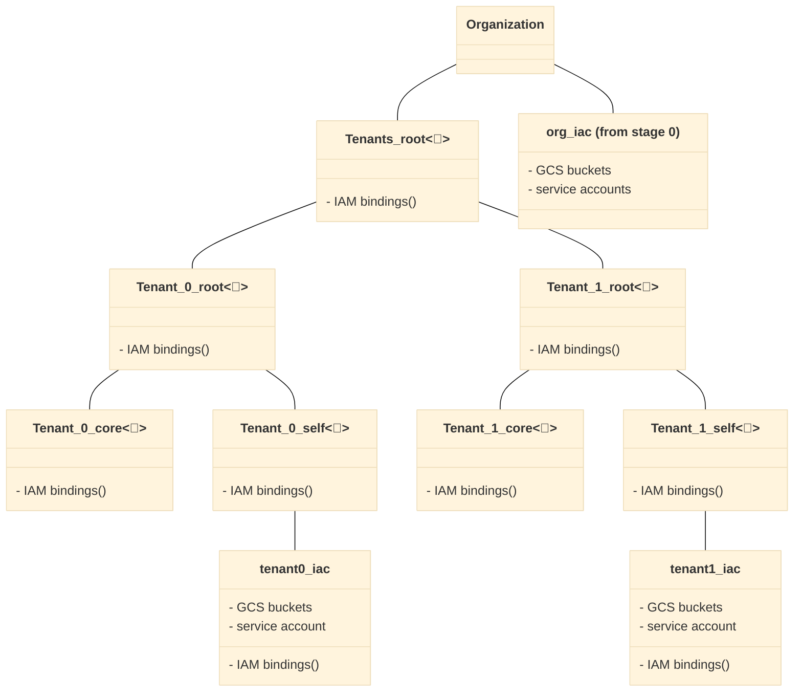

# Resource Hierarchy

This stage provisions Int, Test, and Prod Google Cloud Folders, and Google Cloud Projects contained within, for tenants. In addition, it lays the framework for the subsequent network and security stages by creating the Google Cloud Folder structure for both. There is substantial modification from the original CFF structure, as all Google Cloud Projects MUST reside within the scope of an Assured Workloads Google Cloud Folder.

# Table of Contents

<!-- BEGIN TOC -->
- [Table of Contents](#table-of-contents)
- [Design Overview and Choices](#design-overview-and-choices)
- [How to Run This Stage](#how-to-run-this-stage)
  - [Impersonating the Automation Service Account](#impersonating-the-automation-service-account)
  - [Lightweight multitenancy](#lightweight-multitenancy)
  - [Team Google Cloud Folders](#team-google-cloud-folders)
  - [IAM](#iam)
  - [Additional Google Cloud Folders](#additional-google-cloud-folders)
- [Variables](#variables)
- [Outputs](#outputs)
<!-- END TOC -->

## Design Overview and Choices

The design of this stage ensures that all parts of a Stellar Engine deployment reside within an Assured Workloads Google Cloud Folder; this prevents things like logs from living outside a compliant domain.

## How to Run This Stage

For detailed information on prerequisites and steps to deploy this stage, please see the latest [Detailed Deployment Guide (DDG)](https://drive.google.com/drive/u/0/folders/1OLgdf_VnY8zdkcmxHPwhEVoidGAqY6PX) If you do not have access, you will have to request it.

### Impersonating the Automation Service Account

The preconfigured provider file uses impersonation to run with this stage's automation service account's credentials. The `gcp-devops` and `organization-admins` groups have the necessary IAM bindings in place to do that, so make sure the current user is a member of one of those groups.

### Lightweight multitenancy

If the organization needs to support tenants without the full complexity and separation offered by our [full multitenant support](../../stages-multitenant/), this stage offers a simplified setup which is suitable for cases where tenants have less autonomy, and don't need to implement FAST stages inside their reserved partition.

This mode is activated by defining tenants in the `tenants` variable, while IAM configurations that apply to every tenant can be optionally set in the `tenants_config` variable.

The resulting setup provides a new "Tenants" branch in the Google Cloud Folder hierarchy with one second-level Google Cloud Folder for each tenant, and additional Google Cloud Folders inside it to host tenant resources managed from the central team, and tenant resources managed by the tenant itself. Automation resources are provided for both teams.

This allows subsequent Terraform stages to create network resources for each tenant which are centrally managed and connected to central networking, and tenants themselves to optionally manage their own networking and application Google Cloud Projects.

The default roles applied on tenant Google Cloud Folders are

- on the top-level Google Cloud Folder for each tenant
  - for the core IaC service account
    - `roles/cloudasset.owner`
    - `roles/compute.xpnAdmin`
    - `roles/logging.admin`
    - `roles/resourcemanager.folderAdmin`
    - `roles/resourcemanager.projectCreator`
    - `roles/resourcemanager.tagUser`
- on the core Google Cloud Folder for each tenant
  - for the core IaC service account
    - `roles/owner`
  - for the tenant admin group and IaC service account
    - `roles/viewer`
- on the tenant Google Cloud Folder for each tenant
  - for the tenant admin group and IaC service account
    - `roles/cloudasset.owner`
    - `roles/compute.xpnAdmin`
    - `roles/logging.admin`
    - `roles/resourcemanager.folderAdmin`
    - `roles/resourcemanager.projectCreator`
    - `roles/resourcemanager.tagUser`
    - `roles/owner`

Further customization is possible via the `tenants_config` variable.

This is a high level diagram of the design described above.



This is a list of the variables that need edited to set the Tenant name.

```tfvars
tenants = {
{{EDIT_THIS_VARIABLE_TO_THE_FIRST_TENANT_NAME}} =
  admin_principal  = "group:gcp-devops@example.com"
  descriptive_name = "{{EDIT_THIS_VARIABLE_TO_THE_FIRST_TENANT_DESCRIPTION}}"
  locations = {
    gcs = "us-east4"
    kms = "us-east4" # Must match GCS Region
   }
 },
  {{EDIT_THIS_VARIABLE_TO_THE_SECOND_TENANT_NAME}} =
   admin_principal  = "group:gcp-devops@example.com"
   descriptive_name = "{{EDIT_THIS_VARIABLE_TO_THE_SECOND_TENANT_DESCRIPTION}}"
   locations = {
     gcs = "us-west1"
     kms = "us-west1" # Must match GCS Region
  }
 }
}
```

This is an example that shows a configured variable block with two example Tenants named `wingarch` and  `fuselagerd`.

```tfvars
tenants = {
wingarch =
  admin_principal  = "group:gcp-devops@example.com"
  descriptive_name = "Wing Architect Research Group"
  locations = {
    gcs = "us-east4"
    kms = "us-east4" # Must match GCS Region
   }
 },
  fuselagerd =
   admin_principal  = "group:gcp-devops@example.com"
   descriptive_name = "Fuselage Research & Development Group"
   locations = {
     gcs = "us-west1"
     kms = "us-west1" # Must match GCS Region
  }
 }
}
```

Providers and tfvars files will be created for each tenant.

### Team Google Cloud Folders

This stage provides a single built-in customization that offers a minimal (but usable) implementation of the "application" or "business" grouping for resources discussed above. The `team_folders` variable allows you to specify a map of team name and groups, that will result in Google Cloud Folders, automation service accounts, and IAM policies applied.

Consider the following example in a `tfvars` file using the same example teams from above:

```tfvars
team_folders = {
  wingarch = {
    descriptive_name = "Wing Architect Research Group"
    iam_by_principals = {
      "group:team-a@gcp-pso-italy.net" = [
        "roles/viewer"
      ]
    }
    impersonation_principals = ["group:team-a-admins@gcp-pso-italy.net"]
  }
  fuselagerd = {
    descriptive_name = "Fuselage Research & Development Group"
    iam_by_principals = {
      "group:team-a@gcp-pso-us.net" = [
        "roles/viewer"
      ]
    }
  }
}
```

This will result in

- a "wingarch" Google Cloud Folder under the "Teams" Google Cloud Folder
- one GCS bucket in the automation `Google Cloud Project`
- one service account in the automation `Google Cloud Project` with the correct IAM policies on the Google Cloud Folder and bucket
- a IAM policy on the Google Cloud Folder that assigns `roles/viewer` to the `wingarch` group
- a IAM policy on the service account that allows `wingarch` to impersonate it
- one GCS bucket with KMS CMEK encryption to meet the IL5 requirements
- one service account in the automation `Google Cloud Project` with the correct IAM policies on the Google Cloud Folder and bucket
- a IAM policy on the Google Cloud Folder that assigns `roles/viewer` to the `fuselagerd` group
- a IAM policy on the service account that allows `fuselagerd` to impersonate it
- one default KMS CMEK for use by the main tenant `Google Cloud Project`(s)


This allows to centralize the minimum set of resources to delegate control of each team's Google Cloud Folder to a pipeline, and/or to the team group. This can be used as a starting point for scenarios that implement more complex requirements (e.g. environment Google Cloud Folders per team, etc.).

### IAM

The `folder_iam` variable can be used to manage authoritative bindings for all top-level Google Cloud Folders. For additional control, IAM roles can be easily edited in the relevant `branch-xxx.tf` file, following the best practice outlined in the [bootstrap stage](../0-bootstrap#customizations) documentation of separating user-level and service-account level IAM policies throuth the IAM-related variables (`iam`, `iam_bindings`, `iam_bindings_additive`) of the relevant modules.

A full reference of IAM roles managed by this stage [is available here](./IAM.md).

### Additional Google Cloud Folders

Due to its simplicity, this stage lends itself easily to customizations: adding a new top-level branch (e.g. for shared GKE clusters) is as easy as cloning one of the `branch-xxx.tf` files, and changing names.

---
<!-- BEGIN TFDOC -->
## Variables

| name | description | type | required | default |
|---|---|:---:|:---:|:---:|
| [alert_email](variables.tf#L18) | Email to receive log alerts. | <code>string</code> | ✓ |  |
| [automation](variables.tf#L34) | Automation resources created by the bootstrap stage. | <code title="object&#40;&#123;&#10;  outputs_bucket          &#61; string&#10;  project_id              &#61; string&#10;  project_number          &#61; string&#10;  federated_identity_pool &#61; string&#10;  federated_identity_providers &#61; map&#40;object&#40;&#123;&#10;    audiences        &#61; list&#40;string&#41;&#10;    issuer           &#61; string&#10;    issuer_uri       &#61; string&#10;    name             &#61; string&#10;    principal_branch &#61; string&#10;    principal_repo   &#61; string&#10;  &#125;&#41;&#41;&#10;  service_accounts &#61; object&#40;&#123;&#10;    resman   &#61; string&#10;    resman-r &#61; string&#10;  &#125;&#41;&#10;&#125;&#41;">object&#40;&#123;&#8230;&#125;&#41;</code> | ✓ |  |
| [billing_account](variables.tf#L57) | Billing account id. If billing account is not part of the same org set `is_org_level` to `false`. To disable handling of billing IAM roles set `no_iam` to `true`. | <code title="object&#40;&#123;&#10;  id           &#61; string&#10;  is_org_level &#61; optional&#40;bool, true&#41;&#10;  no_iam       &#61; optional&#40;bool, false&#41;&#10;&#125;&#41;">object&#40;&#123;&#8230;&#125;&#41;</code> | ✓ |  |
| [common_services_folder](variables.tf#L162) | Common services folder where non-tenant related resources should be kept. | <code>string</code> | ✓ |  |
| [envs_folders](variables.tf#L179) | List of environments to be created for projects to go into. | <code title="map&#40;object&#40;&#123;&#10;  admin &#61; string&#10;&#125;&#41;&#41;">map&#40;object&#40;&#123;&#8230;&#125;&#41;&#41;</code> | ✓ |  |
| [organization](variables.tf#L263) | Organization details. | <code title="object&#40;&#123;&#10;  domain      &#61; string&#10;  id          &#61; number&#10;  customer_id &#61; string&#10;&#125;&#41;">object&#40;&#123;&#8230;&#125;&#41;</code> | ✓ |  |
| [prefix](variables.tf#L279) | Prefix used for resources that need unique names. Use 7 characters or less. | <code>string</code> | ✓ |  |
| [regime_mapping](variables.tf#L290) | Mapping of compliance regime names to short codes. | <code>map&#40;string&#41;</code> | ✓ |  |
| [assured_workloads](variables.tf#L23) | Configuration for Assured Workloads. | <code title="object&#40;&#123;&#10;  regime   &#61; optional&#40;string&#41;&#10;  location &#61; optional&#40;string&#41;&#10;  folder   &#61; optional&#40;string&#41;&#10;&#125;&#41;">object&#40;&#123;&#8230;&#125;&#41;</code> |  | <code>&#123;&#125;</code> |
| [cicd_repositories](variables.tf#L68) | CI/CD repository configuration. Identity providers reference keys in the `automation.federated_identity_providers` variable. Set to null to disable, or set individual repositories to null if not needed. | <code title="object&#40;&#123;&#10;  data_platform_dev &#61; optional&#40;object&#40;&#123;&#10;    name              &#61; string&#10;    type              &#61; string&#10;    branch            &#61; optional&#40;string&#41;&#10;    identity_provider &#61; optional&#40;string&#41;&#10;  &#125;&#41;&#41;&#10;  data_platform_prod &#61; optional&#40;object&#40;&#123;&#10;    name              &#61; string&#10;    type              &#61; string&#10;    branch            &#61; optional&#40;string&#41;&#10;    identity_provider &#61; optional&#40;string&#41;&#10;  &#125;&#41;&#41;&#10;  gke_dev &#61; optional&#40;object&#40;&#123;&#10;    name              &#61; string&#10;    type              &#61; string&#10;    branch            &#61; optional&#40;string&#41;&#10;    identity_provider &#61; optional&#40;string&#41;&#10;  &#125;&#41;&#41;&#10;  gke_prod &#61; optional&#40;object&#40;&#123;&#10;    name              &#61; string&#10;    type              &#61; string&#10;    branch            &#61; optional&#40;string&#41;&#10;    identity_provider &#61; optional&#40;string&#41;&#10;  &#125;&#41;&#41;&#10;  gcve_dev &#61; optional&#40;object&#40;&#123;&#10;    name              &#61; string&#10;    type              &#61; string&#10;    branch            &#61; optional&#40;string&#41;&#10;    identity_provider &#61; optional&#40;string&#41;&#10;  &#125;&#41;&#41;&#10;  gcve_prod &#61; optional&#40;object&#40;&#123;&#10;    name              &#61; string&#10;    type              &#61; string&#10;    branch            &#61; optional&#40;string&#41;&#10;    identity_provider &#61; optional&#40;string&#41;&#10;  &#125;&#41;&#41;&#10;  networking &#61; optional&#40;object&#40;&#123;&#10;    name              &#61; string&#10;    type              &#61; string&#10;    branch            &#61; optional&#40;string&#41;&#10;    identity_provider &#61; optional&#40;string&#41;&#10;  &#125;&#41;&#41;&#10;  project_factory_dev &#61; optional&#40;object&#40;&#123;&#10;    name              &#61; string&#10;    type              &#61; string&#10;    branch            &#61; optional&#40;string&#41;&#10;    identity_provider &#61; optional&#40;string&#41;&#10;  &#125;&#41;&#41;&#10;  project_factory_prod &#61; optional&#40;object&#40;&#123;&#10;    name              &#61; string&#10;    type              &#61; string&#10;    branch            &#61; optional&#40;string&#41;&#10;    identity_provider &#61; optional&#40;string&#41;&#10;  &#125;&#41;&#41;&#10;  security &#61; optional&#40;object&#40;&#123;&#10;    name              &#61; string&#10;    type              &#61; string&#10;    branch            &#61; optional&#40;string&#41;&#10;    identity_provider &#61; optional&#40;string&#41;&#10;  &#125;&#41;&#41;&#10;&#125;&#41;">object&#40;&#123;&#8230;&#125;&#41;</code> |  | <code>null</code> |
| [custom_roles](variables.tf#L167) | Custom roles defined at the org level, in key => id format. | <code title="object&#40;&#123;&#10;  gcve_network_admin            &#61; string&#10;  organization_admin_viewer     &#61; string&#10;  service_project_network_admin &#61; string&#10;  storage_viewer                &#61; string&#10;&#125;&#41;">object&#40;&#123;&#8230;&#125;&#41;</code> |  | <code>null</code> |
| [factories_config](variables.tf#L186) | Configuration for the resource factories or external data. | <code title="object&#40;&#123;&#10;  checklist_data &#61; optional&#40;string&#41;&#10;&#125;&#41;">object&#40;&#123;&#8230;&#125;&#41;</code> |  | <code>&#123;&#125;</code> |
| [fast_features](variables.tf#L195) | Selective control for top-level FAST features. | <code title="object&#40;&#123;&#10;  data_platform   &#61; optional&#40;bool, false&#41;&#10;  gke             &#61; optional&#40;bool, false&#41;&#10;  gcve            &#61; optional&#40;bool, false&#41;&#10;  project_factory &#61; optional&#40;bool, false&#41;&#10;  sandbox         &#61; optional&#40;bool, false&#41;&#10;  teams           &#61; optional&#40;bool, false&#41;&#10;  envs            &#61; optional&#40;bool, false&#41;&#10;&#125;&#41;">object&#40;&#123;&#8230;&#125;&#41;</code> |  | <code>&#123;&#125;</code> |
| [folder_iam](variables.tf#L211) | Authoritative IAM for top-level folders. | <code title="object&#40;&#123;&#10;  data_platform &#61; optional&#40;map&#40;list&#40;string&#41;&#41;, &#123;&#125;&#41;&#10;  envs          &#61; optional&#40;map&#40;list&#40;string&#41;&#41;, &#123;&#125;&#41;&#10;  gcve          &#61; optional&#40;map&#40;list&#40;string&#41;&#41;, &#123;&#125;&#41;&#10;  gke           &#61; optional&#40;map&#40;list&#40;string&#41;&#41;, &#123;&#125;&#41;&#10;  sandbox       &#61; optional&#40;map&#40;list&#40;string&#41;&#41;, &#123;&#125;&#41;&#10;  security      &#61; optional&#40;map&#40;list&#40;string&#41;&#41;, &#123;&#125;&#41;&#10;  network       &#61; optional&#40;map&#40;list&#40;string&#41;&#41;, &#123;&#125;&#41;&#10;  teams         &#61; optional&#40;map&#40;list&#40;string&#41;&#41;, &#123;&#125;&#41;&#10;  tenants       &#61; optional&#40;map&#40;list&#40;string&#41;&#41;, &#123;&#125;&#41;&#10;&#125;&#41;">object&#40;&#123;&#8230;&#125;&#41;</code> |  | <code>&#123;&#125;</code> |
| [groups](variables.tf#L228) | Group names or IAM-format principals to grant organization-level permissions. If just the name is provided, the 'group:' principal and organization domain are interpolated. | <code title="object&#40;&#123;&#10;  gcp-billing-admins      &#61; optional&#40;string, &#34;gcp-billing-admins&#34;&#41;&#10;  gcp-devops              &#61; optional&#40;string, &#34;gcp-devops&#34;&#41;&#10;  gcp-vpc-network-admins  &#61; optional&#40;string, &#34;gcp-vpc-network-admins&#34;&#41;&#10;  gcp-organization-admins &#61; optional&#40;string, &#34;gcp-organization-admins&#34;&#41;&#10;  gcp-security-admins     &#61; optional&#40;string, &#34;gcp-security-admins&#34;&#41;&#10;&#125;&#41;">object&#40;&#123;&#8230;&#125;&#41;</code> |  | <code>&#123;&#125;</code> |
| [locations](variables.tf#L243) | Optional locations for GCS, BigQuery, and logging buckets created here. | <code title="object&#40;&#123;&#10;  bq      &#61; string&#10;  gcs     &#61; string&#10;  logging &#61; string&#10;  pubsub  &#61; list&#40;string&#41;&#10;  kms     &#61; string&#10;&#125;&#41;">object&#40;&#123;&#8230;&#125;&#41;</code> |  | <code title="&#123;&#10;  bq      &#61; &#34;US&#34;&#10;  gcs     &#61; &#34;US&#34;&#10;  kms     &#61; &#34;nam9&#34;&#10;  logging &#61; &#34;us&#34;&#10;  pubsub  &#61; &#91;&#93;&#10;&#125;">&#123;&#8230;&#125;</code> |
| [outputs_location](variables.tf#L273) | Enable writing provider, tfvars and CI/CD workflow files to local filesystem. Leave null to disable. | <code>string</code> |  | <code>null</code> |
| [team_folders](variables.tf#L295) | Team folders to be created. Format is described in a code comment. | <code title="map&#40;object&#40;&#123;&#10;  descriptive_name         &#61; string&#10;  iam_by_principals        &#61; map&#40;list&#40;string&#41;&#41;&#10;  impersonation_principals &#61; list&#40;string&#41;&#10;  cicd &#61; optional&#40;object&#40;&#123;&#10;    branch            &#61; string&#10;    identity_provider &#61; string&#10;    name              &#61; string&#10;    type              &#61; string&#10;  &#125;&#41;&#41;&#10;&#125;&#41;&#41;">map&#40;object&#40;&#123;&#8230;&#125;&#41;&#41;</code> |  | <code>null</code> |
| [tenants](variables.tf#L311) | Lightweight tenant definitions. | <code title="map&#40;object&#40;&#123;&#10;  admin_principal  &#61; string&#10;  descriptive_name &#61; string&#10;  billing_account  &#61; optional&#40;string&#41;&#10;  compliance &#61; optional&#40;object&#40;&#123;&#10;    regime   &#61; string&#10;    location &#61; string&#10;  &#125;&#41;&#41;&#10;  locations &#61; optional&#40;object&#40;&#123;&#10;    gcs &#61; string&#10;    kms &#61; string&#10;  &#125;&#41;&#41;&#10;  organization &#61; optional&#40;object&#40;&#123;&#10;    customer_id &#61; string&#10;    domain      &#61; string&#10;    id          &#61; number&#10;  &#125;&#41;&#41;&#10;&#125;&#41;&#41;">map&#40;object&#40;&#123;&#8230;&#125;&#41;&#41;</code> |  | <code>&#123;&#125;</code> |
| [tenants_config](variables.tf#L340) | Lightweight tenants shared configuration. Roles will be assigned to tenant admin group and service accounts. | <code title="object&#40;&#123;&#10;  core_folder_roles   &#61; optional&#40;list&#40;string&#41;, &#91;&#93;&#41;&#10;  tenant_folder_roles &#61; optional&#40;list&#40;string&#41;, &#91;&#93;&#41;&#10;  top_folder_roles    &#61; optional&#40;list&#40;string&#41;, &#91;&#93;&#41;&#10;&#125;&#41;">object&#40;&#123;&#8230;&#125;&#41;</code> |  | <code>&#123;&#125;</code> |

## Outputs

| name | description | sensitive |
|---|---|:---:|
| [cicd_repositories](outputs.tf#L396) | WIF configuration for CI/CD repositories. |  |
| [dataplatform](outputs.tf#L410) | Data for the Data Platform stage. |  |
| [envs](outputs.tf#L426) | Environments folders created for the tenants. |  |
| [gcve](outputs.tf#L431) | Data for the GCVE stage. |  |
| [gke_multitenant](outputs.tf#L452) | Data for the GKE multitenant stage. |  |
| [networking](outputs.tf#L473) | Data for the networking stage. |  |
| [project_factories](outputs.tf#L482) | Data for the project factories stage. |  |
| [providers](outputs.tf#L497) | Terraform provider files for this stage and dependent stages. | ✓ |
| [sandbox](outputs.tf#L504) | Data for the sandbox stage. |  |
| [security](outputs.tf#L518) | Data for the networking stage. |  |
| [team_cicd_repositories](outputs.tf#L528) | WIF configuration for Team CI/CD repositories. |  |
| [teams](outputs.tf#L542) | Data for the teams stage. |  |
| [tfvars](outputs.tf#L554) | Terraform variable files for the following stages. | ✓ |
<!-- END TFDOC -->
