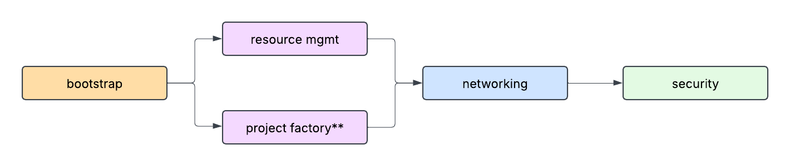

# FAST Stages

Each of the git folders contained here is a separate "stage", or Terraform root module.

Each stage can be run in isolation (for example to only bring up a hub and spoke VPC in an existing environment), but when combined together they form a modular setup that allows top-down configuration of a whole GCP organization.

When combined together, each stage is designed to leverage the previous stage's resources and to provide outputs to the following stages via predefined contracts, that regulate what is exchanged.

This has two important consequences

- any stage can be swapped out and replaced by different code as long as it respects the contract by providing a predefined set of outputs and optionally accepting a predefined set of variables
- data flow between stages can be partially automated (see [stage 00 documentation on output files](./0-bootstrap/README.md#output-files-and-cross-stage-variables)), reducing the effort and pain required to compile variables by hand

One important assumption is that the flow of data is always forward looking, so no stage needs to depend on outputs generated further down the chain. This greatly simplifies both the logic and the implementation, and allows stages to be effectively independent.

To achieve this, we rely on specific GCP functionality like [delegated role grants](https://medium.com/google-cloud/managing-gcp-service-usage-through-delegated-role-grants-a843610f2226) that allow controlled delegation of responsibilities, for example to allow managing IAM bindings at the organization level in different stages only for specific roles.

Refer to each stage's documentation for a detailed description of its purpose, the architectural choices made in its design, and how it can be configured and wired together to terraform a whole GCP organization. The following is a brief overview of each stage.

To destroy a previous FAST deployment follow the instructions detailed in [cleanup](CLEANUP.md).

## Fast Stages Diagram

## Organization (0 and 1)

- [Bootstrap](0-bootstrap/README.md)  
  Enables critical Google Cloud Organization level functionality, including the provisioning of a top-level Assured Workloads Google Cloud Folder, that depends on broad permissions. It has two primary purposes. The first is to bootstrap the resources needed for automation of this and the following stages (service accounts, GCS buckets). Secondly, it applies the minimum amount of configuration needed at the Google Cloud Organization level to avoid the need of broad permissions later on, and to implement from the start critical auditing or security features like organization policies, sinks and exports.\
  Exports: automation variables, organization-level custom roles
- [Resource Management](1-resman/README.md)  
  Creates the base resource hierarchy (Google Cloud Folders) and the automation resources that will be required later to delegate deployment of each part of the hierarchy to separate stages. This stage also configures resource management tags used in scoping specific IAM roles on the resource hierarchy. Note that the project factory takes place in this stage to ensure consistency with the architecture established by Cloud One. To add, modify, or delete users, please modify the tfvars file in this stage and rerun the terraform.

## Networking (2)

- [IL5 Compliant](2-networking-b-il5-ngfw/README.md)
- [FedRAMP High Compliant](2-networking-a-fedramp-high/README.md)
  Manages centralized network resources in a separate stage, and is typically owned by the networking team. This stage implements a hub-and-spoke design, and includes connectivity via VPN to on-premises, and YAML-based factories for firewall rules (hierarchical and VPC-level) and subnets. Currently, two networking options (IL5 and FedRAMP High Compliant) are available, with a third lightweight networking option currently being developed, with recommended usage in IL2 and FedRAMP Moderate environments.

## Security (3)

- [Security](3-security/README.md)
This stage provides an added layer of security to deployment. To further secure your environment, please see the [Security Best Practices Guide](https://docs.google.com/document/d/1uv62Fqg73r9oJNP-NPZebpzoBom8rOgLoHkiMZPutbo/edit?tab=t.0#heading=h.gjdgxs). You will need to request access if you do not already have it.

